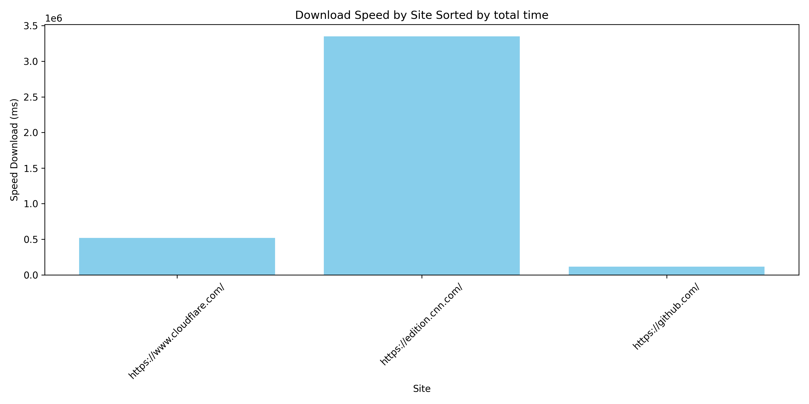
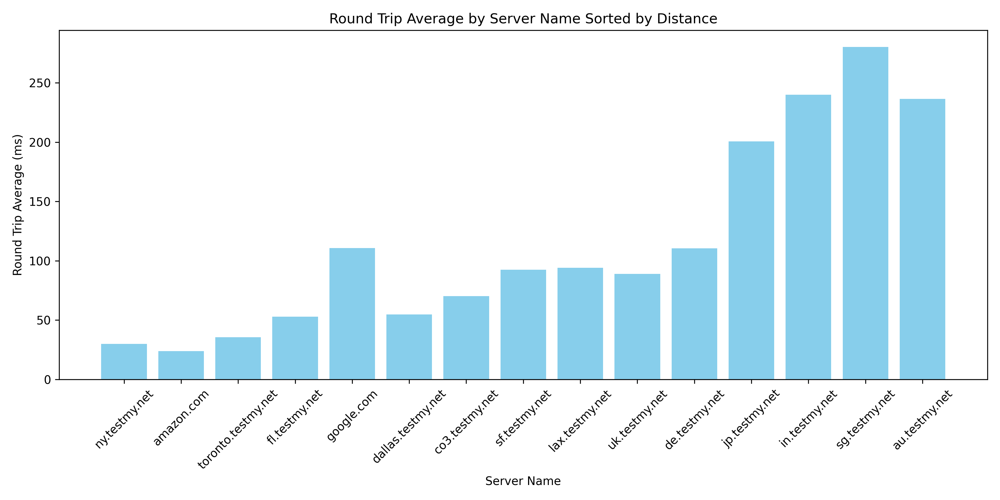
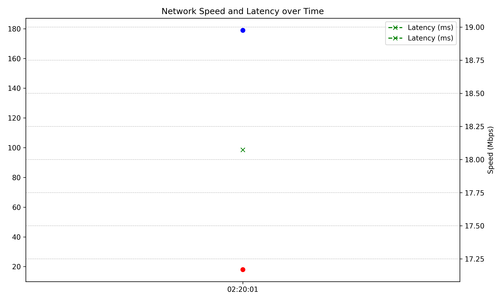

# Network Performance 
The aim of this tool is to create an environment to test network performance.

### Tests
speedtest to local server and graph results
webpage download and graph of results
icmp latency and graph of results

### Setup
- run ./setup.sh to launch python virtual environment and install requirements

### Make file
- make install to install the packages
- make mac will install speedtest cli for mac
- make win will install speedtest cli for windows
- make lint 
- make format 
- make directory will create the directory structure for the project
- 
### Excutables
python vpn_perf.py 

### results
- results are stored in the results directory
- latency results are stored in the results/latency directory
  - there is csv and json version 
  - there is a graph of the results in the results/latency/graphs directory
- speedtest results are stored in the results/speedtest directory
  - there is csv and json version 
  - there is a graph of the results in the results/speedtest/graphs directory
- website results are stored in the results/website directory
  - there is csv and json version 
  - there is a graph of the results in the results/website/graphs directory
  
### Images

